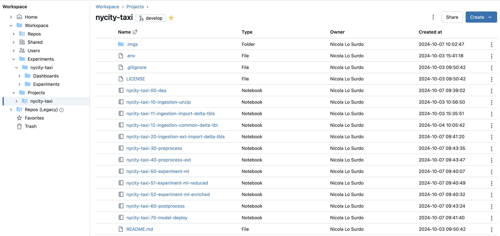
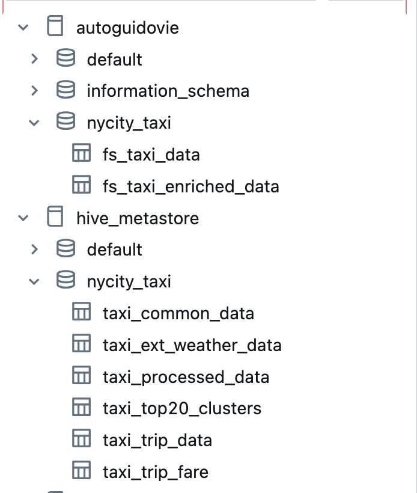
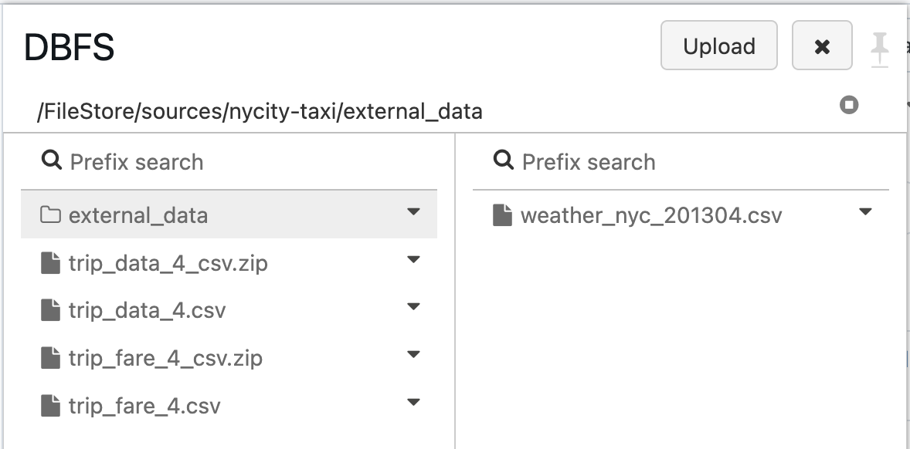
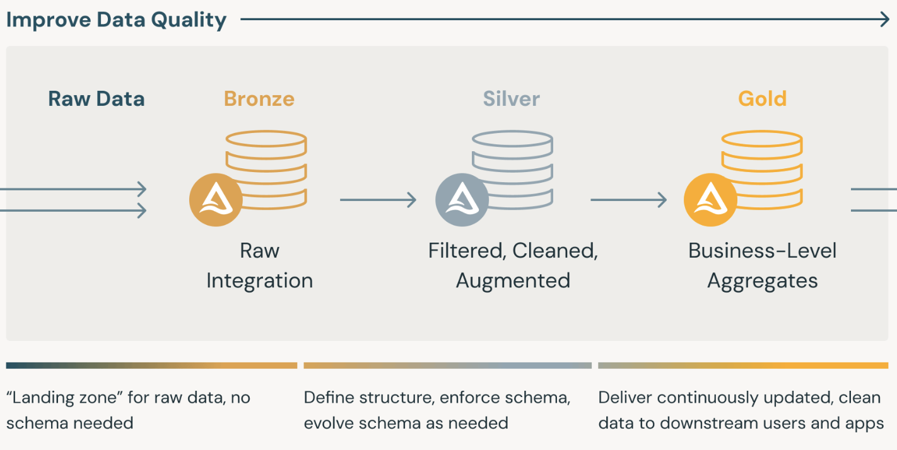
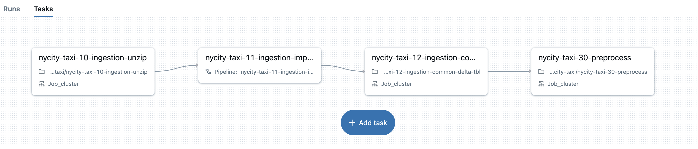
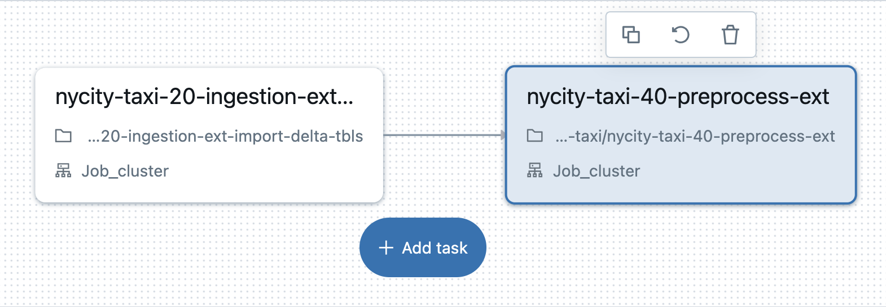
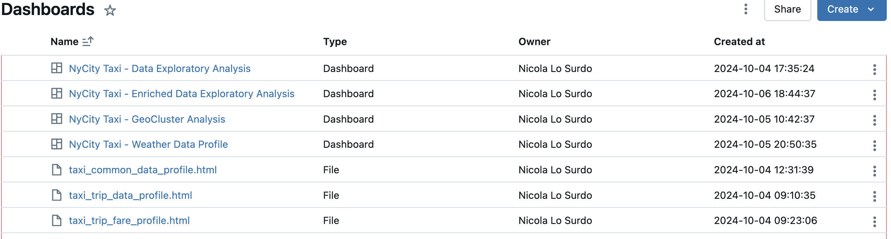
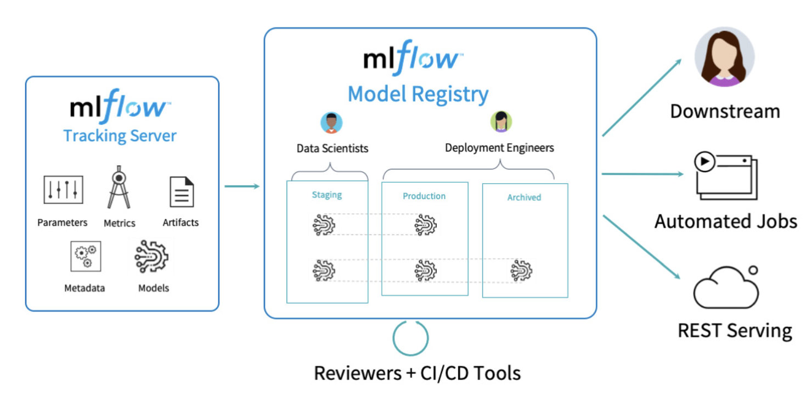

# New York Taxi - ML e DevOps in ambiente Databricks

Questo progetto si concentra sull'analisi e la predizione del **total_amount** delle corse dei taxi di New York utilizzando un dataset storico di oltre 14 milioni di viaggi registrati nell'aprile 2013. L'obiettivo del repository è condividere una metodologia di lavoro su come approcciare un tipico use case di machine learning seguendo le best practice di ML e DevOps. Viene illustrato come standardizzare e automatizzare l'intero processo, dall'addestramento dei modelli alla produzione e al monitoraggio in Databricks, mettendo in evidenza gli aspetti architetturali principali

-----

### DataBricks: Architettura, automazione e deploy
**Perché Databricks?**
<br>
La messa in produzione e il deploy dei modelli rappresentano spesso una sfida critica per il successo di un use case di machine learning, a causa delle complessità operative e dei limiti di scalabilità. Databricks affronta queste sfide migliorando il processo con strumenti avanzati come MLflow e Delta Lake, che consentono di tracciare, versionare e gestire i modelli in modo trasparente, in un ambiente unificato, flessibile ed a risorse scalabili. Vediamo come sfruttare queste funzionalità per il nostro use case, come è stato organizzato il Workspace e scoprire i criteri organizzativi utilizzati

**Organizzazione del Workspace**

**La fase di sviluppo e di esplorazione** avviene in un ambiente dedicato, rappresentato dalla cartella principale **Experiment**, non sottoposta a versionamento. Per ogni nuovo progetto, in maniera scalabile, viene creato un folder specifico. Per il nostro use case, la cartella progettuale è `nycity-taxi`. All'interno di questa cartella, ci sono due sottocartelle: **Dashboard**, per i report e le analisi di progetto e **Experiment**, destinata agli esperimenti con MLflow.

**La fase di rilascio e versionamento** avviene in un secondo ambiente, rappresentato dalla cartella principale **Projects**. Anche qui, viene creata una sotto cartella per ogni progetto, seguendo un'organizzazione simmetrica all'area Experiment. Ogni cartella è collegata ad un **repository Git**, che a sua volta è integrato con una **pipeline CI/CD** per il testing ed il deploy nei tre ambienti di sviluppo, test e produzione.

Per quanto riguarda il **catalogo**, il ragionamento è lo stesso: ogni progetto ha uno **schema** di database dedicato.

Nel File System, i file di origine sono organizzati ancora una volta per progetto, in modo simmetrico e con ugual nomenclatura alle altre aree. Per questo use case è stato creato il percorso `/FileStore/sources/nycity-taxi`.
<br>
<br>



<br>

-----

### DataBricks: Medallion architecture
L'architettura del progetto adotta l'approccio a "**medaglie**" di Databricks (Bronze, Silver, Gold), una struttura a livelli per organizzare e gestire i dati in modo efficiente. In questo contesto, i dati grezzi vengono acquisiti nel livello Bronze, poi puliti e trasformati nel livello Silver, e infine arricchiti per l'uso nei modelli predittivi nel livello Gold.
<br><br>


**Prima Pipeline - I Dati dei Taxi di NYC** <br>
I job di Databricks sono sequenze di operazioni che permettono di eseguire processi di data engineering, machine learning o qualsiasi task di elaborazione dati in modo programmato e gestito. Ogni job può essere configurato per eseguire notebook, script o pipeline, schedulati secondo una cadenza prestabilita o attivati da eventi specifici.

In questo progetto, il **workflow** si compone dei seguenti notebook, ognuno responsabile di un passo specifico:

**Bronze:** Ingestione e decompressione dei dati <br>
Il job parte eseguendo il notebook `nycity-taxi-10-ingestion-unzip`, che decomprime i file zip e prepara i file .csv per l'importazione nel DBFS.

**Bronze:** Importazione nelle Delta Tables <br>
Successivamente, il notebook `nycity-taxi-11-ingestion-import-delta-tbls` importa i dati in Delta Tables utilizzando le pipeline dlt dichiarative di Databricks, automatizzando il caricamento incrementale dei dati e la gestione del DB schema.

**Silver:** Pulizia e preparazione dei dati <br>
Nel notebook `nycity-taxi-12-ingestion-common-delta-tbl`, i dati vengono filtrati, i record duplicati rimossi e i due dataset uniti in un'unica tabella per una gestione più efficiente.

**Gold:** Feature engineering e clustering <br>
Il notebook `nycity-taxi-30-preprocess` arricchisce il dataset con variabili temporali e applica il clustering KMeans per definire i cluster geografici di pickup e dropoff.



Adesso vediamo nel dettaglio i passaggi operativi più importanti all'interno del job:

Notebook: `nycity-taxi-12-ingestion-common-delta-tbl` <br>
In questa fase, vengono rimossi i record che presentano valori anomali, come quelli con variabili cruciali settate a zero, come le coordinate geografiche del pickup, la distanza e il tempo di percorrenza. Questo passaggio è essenziale per garantire l'integrità dei dati.

```
taxi_trip_data = taxi_trip_data.filter(
    (taxi_trip_data['trip_time_in_secs'] != 0) &
    (taxi_trip_data['trip_distance'] != 0) &
    (taxi_trip_data['pickup_latitude'] != 0) &
    (taxi_trip_data['pickup_longitude'] != 0)
)
```
Successivamente, si identifica e si crea la chiave primaria composta da `['medallion', 'hack_license', 'pickup_datetime']`, eliminando circa 100 record duplicati. I dataset puliti vengono uniti, e la tabella risultante viene salvata nel catalogo come Delta Table.
```
output_deltatable = "hive_metastore.nycity_taxi.taxi_common_data"
taxi_common_data.write.format(
  "delta").mode("overwrite").saveAsTable(output_deltatable)
```

Notebook: `nycity-taxi-30-preprocess` <br>
Qui, vengono create nuove variabili a partire dalla colonna `pickup_datetime`, tra cui il giorno della settimana, l'ora e i minuti del pickup. Queste variabili temporali arricchiscono il dataset e forniscono informazioni aggiuntive utili all'analisi.
```
taxi_common_data = taxi_common_data.withColumn(
    "pickup_day_of_week", F.dayofweek("pickup_datetime")
)
taxi_common_data = taxi_common_data.withColumn(
    "pickup_hour", F.hour("pickup_datetime")
)
taxi_common_data = taxi_common_data.withColumn(
    "pickup_minute", F.minute("pickup_datetime")
)
```
Un'altra fase critica è l'applicazione del clustering KMeans alle coordinate di latitudine e longitudine, con l'obiettivo di raggruppare le aree geografiche di pickup e dropoff dei taxi in k cluster, migliorando così l'analisi spaziale.
```
def cluster_coordinates(df, lat_col, lon_col, k, new_col_name):
    assembler = VectorAssembler(inputCols=[lat_col, lon_col], outputCol="features")
    assembled_data = assembler.transform(df)
    kmeans = KMeans(k=k, seed=42)
    model = kmeans.fit(assembled_data)
    clusters = model.transform(assembled_data)
    return clusters.withColumnRenamed("prediction", new_col_name).drop("features")
```
Infine, vengono eliminate le variabili disponibili solo a corsa conclusa (ad esempio, la durata del viaggio o l'importo della corsa), poiché non sarebbero utili per la predizione.
```
columns_to_remove = [
    "trip_time_in_secs",
    "fare_amount",
    "tip_amount",
    "tolls_amount",
    "pickup_datetime",
    "dropoff_datetime",
    "pickup_latitude",
    "pickup_longitude",
    "dropoff_latitude",
    "dropoff_longitude",
]
```
Il **Feature Store di Databricks** è uno strumento che permette di centralizzare, gestire e riutilizzare le feature create durante lo sviluppo di modelli di machine learning. Questo sistema facilita la condivisione e il riutilizzo delle feature tra team diversi, migliorando la consistenza dei modelli predittivi. Il risultato finale del job, quindi, è una tabella Delta scritta nel Feature Store di Databricks, contenente i dati arricchiti con i cluster di pickup e le fasce orarie.
```
fs.create_table(
    name="nycity_taxi.fs_taxi_data",
    primary_keys=["pr_key"],
    df=taxi_common_data_fs,
    description="NYC Taxi data with clustered pickup and dropoff locations",
)
```

------

**Seconda Pipeline - I Dati climatici Esterni** <br>
Questa pipeline è dedicata all'acquisizione e all'integrazione di dati esterni e di terze parti. Per questo use case, ho scaricato i dati metereologici di New York relativi ad aprile 2013, con granularità oraria, dal servizio [visualcrossing](https://www.visualcrossing.com/weather/weather-data-services) 




**Bronze** <br>
Notebook: `nycity-taxi-20-ingestion-ext-import-delta-tbls` <br>
Il file csv contenente i dati metereologici esterni viene importato nel sistema utilizzando le pipeline dichiarative di Databricks, che consentono di caricare il file come una Delta Table.

**Silver/Gold** <br>
Notebook: `nycity-taxi-40-preprocess-ext` <br>
Questa fase inizia dalla tabella presente nel Feature Store, che rappresenta l'output della prima pipeline.
```
taxi_data = fs.read_table("autoguidovie.nycity_taxi.fs_taxi_enriched_data")
```
A questo punto, i dati vengono arricchiti con le informazioni metereologiche di maggior interesse per lo use case, come umidità, precipitazioni, velocità del vento e condizioni atmosferiche. Questi dati metereologici vengono uniti ai dati delle corse in base alla colonna `pickup_datetime`, assicurandosi che ogni corsa sia associata al dato climatico corrispondente all'ora di riferimento.

```
fs_taxi_enriched_data = fs_taxi_data.join(
    taxi_weather_data.select(
        "datetime_normalized",
        "humidity",
        "precip",
        "preciptype",
        "windspeed",
        "cloudcover",
        "visibility",
        "conditions",
        "temp"
    ),
    (fs_taxi_data.pickup_datetime >= taxi_weather_data.datetime_normalized) &
    (fs_taxi_data.pickup_datetime < F.expr("datetime_normalized + interval 1 hour")),
    how="left",
).drop(
    *["datetime_normalized", "pickup_datetime"]
)
```
Infine, la tabella arricchita con i dati climatici viene scritta nuovamente nel Feature Store, pronta per essere utilizzata nei modelli predittivi. Questo passaggio completa il processo di integrazione dei dati esterni.

-----

### Dashboards: Data Analysis
Le Dashboard in Databricks sono strumenti essenziali per la visualizzazione e l'analisi dei dati. Possono essere collegate a un dataset specifico o embeddate direttamente all'interno di un notebook, permettendo un'interazione continua e dinamica con i risultati delle analisi

Nel nostro progetto, ho utilizzato **pandas-profiling** come primo step per esplorare il dataset, ottenendo un'analisi approfondita dei dati. Questo mi ha permesso di individuare rapidamente elementi come i valori mancanti, gli zeri, e le distribuzioni delle variabili, con un'overview chiara del dataset. 

Oltre alle dashboard embeddate nei notebook, ho creato quattro main dashboard, utili all'explorazione di pattern ed insight dai dati in via preliminare alla modellazione. Queste dashboard ed i file html generati da pandas-profiling sono stati collocati nella cartella **dashboard** all'interno dell'area Experiment.

E' possibile consultare i risultati, gli insights ed i contenuti delle analisi effettuate, nella presentazione .pdf allegata a questo git repo.
<br><br>


-----

### Mlflow: Machine Learning Models

MLflow è stato utilizzato per gestire il ciclo di vita dei modelli di machine learning, garantendo il tracciamento degli esperimenti, la riproducibilità e il deploy



Nel progetto sono stati realizzati **tre esperimenti distinti**.

**Esperimento a variabili ridotte**: Sono state rimosse variabili come `trip_distance` e `payment_type`, lasciando solo quelle conosciute prima che il passeggero salga a bordo. L'obiettivo è fornire un modello utile al taxi driver per ottimizzare i propri spostamenti e massimizzare il profitto delle corse.

**Esperimento a variabili complete**: Questo esperimento utilizza tutte le variabili disponibili per valutare la capacità del modello di predire accuratamente il costo finale della corsa una volta che il passeggero è salito a bordo.

**Esperimento con variabili atmosferiche**: È stato infine aggiunto un set di variabili climatiche per verificare se condizioni atmosferiche come la temperatura o il vento possono migliorare la precisione del modello.

**Processo** <br>
- Ogni esperimento viene tracciato e loggato tramite MLflow, e salvato nella cartella Experiment.
- Il miglior modello viene registrato nel MLflow registry direttamente tramite codice Python nella pipeline.
- Successivamente, lo script Python prepara il deploy del modello.
- Al rilascio della code base negli ambienti di collaudo e produzione, la ML pipeline, una volta attivata, registrerà e deployerà automaticamente il miglior modello, esponendo l'endpoint tramite Databricks Serve.
- Questo approccio garantisce un monitoraggio completo delle performance del modello (R2, MAE, RMSE) e una gestione automatizzata delle versioni.

Adesso vediamo nel dettaglio i passaggi operativi più importanti all'interno della pipeline, ricordando che è possibile consultare i risultati, gli insights ed i contenuti dei modelli, nella presentazione .pdf allegata a questo git repo.

Dal **Feature Store** viene estratta la tabella contenente le feature necessarie per il training del modello, che viene trasformata da un DataFrame Spark a un DataFrame Pandas. Successivamente, le variabili indipendenti (X) e dipendenti (Y) vengono separate
```
taxi_data = fs.read_table("autoguidovie.nycity_taxi.fs_taxi_data")
df = taxi_data.toPandas()
Y = df['Y']
X = df.drop(columns=['Y', 'pr_key'])
```
Si procede con l'**encoding** delle feature categoriche usando il metodo **OneHotEncoding**. Questa scelta è stata motivata dalla bassa cardinalità delle variabili categoriali e dal loro numero limitato (solo 3). Non sono state apportate trasformazioni alle variabili ordinali come `pickup_hour`, `pickup_time`, e `rate_code`.
```
categorical_features = ['vendor_id', 'store_and_fwd_flag', 'payment_type']
encoder = OneHotEncoder(sparse=False)
X_encoded = pd.DataFrame(
    encoder.fit_transform(X[categorical_features]),
    columns=encoder.get_feature_names_out(categorical_features)
)
X = pd.concat([
    X.drop(columns=categorical_features),
    X_encoded],
    axis=1
)
```
Le variabili sono ora in formato numerico, consentendo la **normalizzazione della distribuzione**.
```
scaler = StandardScaler()
X_scaled = scaler.fit_transform(X)
```
Il dataset viene suddiviso in Train (80%) e Test (20%), e l'**esperimento MLflow** viene avviato per tracciare le performance del modello.
```
X_train, X_test, Y_train, Y_test = train_test_split(X_scaled, Y, test_size=0.2, random_state=42)

signature = infer_signature(X_train, Y_train)

experiment_name = "/Experiments/nycity-taxi/NyCity Taxi - Base Reference"
mlflow.set_experiment(experiment_name)
```
Il primo modello di riferimento scelto è il **DecisionTreeRegressor**, con parametri di default. Vengono tracciate le metriche **R2, RMSE, e MAE**.
```
with mlflow.start_run(run_name='DecisionTreeRegressor'):
    # Train a regression tree model with default parameters
    reg_tree = DecisionTreeRegressor()
    reg_tree.fit(X_train, Y_train)

    # Test the model on the test set
    Y_pred = reg_tree.predict(X_test)

    # Evaluate the model
    r2 = r2_score(Y_test, Y_pred)
    rmse = np.sqrt(mean_squared_error(Y_test, Y_pred))
    mae = mean_absolute_error(Y_test, Y_pred)

    # Log the model and metrics in MLflow
    mlflow.log_metric('R2', r2)
    mlflow.log_metric('rmse', rmse)
    mlflow.log_metric('mae', mae)
    mlflow.sklearn.log_model(reg_tree, "model", signature=signature)
```
Il modello avanzato scelto è **XGBoost**, ottimizzato con **RandomizedSearchCV**. Anche in questo caso, vengono tracciate le metriche **R2, RMSE, e MAE**, e il miglior modello viene selezionato.
```
with mlflow.start_run(run_name='Hypertuned XGBoost'):
    xgb = XGBRegressor(objective='reg:squarederror', random_state=42)

    param_distributions = {
        'n_estimators': np.arange(100, 301, 100),
        'learning_rate': [0.01, 0.1, 0.2],
        'max_depth': np.arange(3, 8),
        'subsample': [0.8, 1],
        'colsample_bytree': [0.8, 1]
    }

    # Set up RandomizedSearchCV for hyperparameter tuning
    random_search = RandomizedSearchCV(estimator=xgb, param_distributions=param_distributions, 
                                    n_iter=10, scoring='r2', cv=3, verbose=2, random_state=42)


    # Train the model with RandomizedSearchCV
    random_search.fit(X_train, Y_train)

    # Get the best model from RandomizedSearchCV
    best_xgb = random_search.best_estimator_

    # Make predictions on the test set
    Y_pred = best_xgb.predict(X_test)

    # Evaluate the model
    r2 = r2_score(Y_test, Y_pred)
    rmse = np.sqrt(mean_squared_error(Y_test, Y_pred))
    mae = mean_absolute_error(Y_test, Y_pred)

    # Log the model and metrics in MLflow
    mlflow.log_metric('R2', r2)
    mlflow.log_metric('rmse', rmse)
    mlflow.log_metric('mae', mae)

    mlflow.sklearn.log_model(best_xgb, "model", signature=signature)
```
Il modello più performante viene analizzato con **SHAP TreeExplainer** per comprendere il contributo di ogni variabile nelle predizioni.
```
explainer = shap.TreeExplainer(best_xgb)
shap_values = explainer.shap_values(X_test)

shap.summary_plot(shap_values, X_test, feature_names=X.columns)

shap.dependence_plot("pickup_day_of_week", shap_values, X_test, feature_names=X.columns)

shap.dependence_plot("pickup_hour", shap_values, X_test, feature_names=X.columns)

shap.dependence_plot("dropoff_clusters_m", shap_values, X_test, feature_names=X.columns)

shap.dependence_plot("pickup_clusters_m", shap_values, X_test, feature_names=X.columns)
```

-----
### Mlflow: Model Deploy
Infine, il modello migliore viene registrato nel **MLflow Model Registry** e preparato per il deploy.
```
run_id = '57316c9e729442b7a4a80bad4660380c'
model_uri = f"runs:/{run_id}/model"
model_name = "NyTaxi-XGBoostReduced"

mlflow.register_model(model_uri=model_uri, name=model_name)
```
Il modello registrato viene poi distribuito per inferenze da client esterni tramite **Databricks Serve**, esponendo un endpoint interrogabile con richieste POST API.
```
client = MlflowClient()

latest_version_info = client.get_latest_versions(name=model_name, stages=["None"])
model_version = latest_version_info[0].version

client.transition_model_version_stage(
    name=model_name,
    version=model_version,
    stage="Production",
    archive_existing_versions=True
)
```

-----
### CI PIPELINE

Il modello di deploy prevede che la pipeline venga triggerata automaticamente ad ogni **push** sul branch principale.  La pipeline CI esegue il linting e il testing del codice tramite Docker. 

Il **deploy degli oggetti Databricks** (come jobs e pipeline Delta Live Table) avviene tramite file **JSON**, che definiscono la configurazione degli oggetti e vengono gestiti attraverso il **Databricks CLI**, consentendo la loro creazione o aggiornamento direttamente nell'ambiente Databricks. 

Una volta che il codice è stato mergiato, viene distribuito nell'ambiente di **collaudo** e pullato dal relativo workspace per i test. Successivamente, completati i test con successo, il codice viene distribuito nell'ambiente di **produzione** per il rilascio definitivo.